### Making the sterile hood
Design: [BioHack Academy Sterile hood](https://github.com/BioHackAcademy/BHA_SterileHood)

It's important to keep a clean environment when conducting experiments to avoid contamination. There are many particles in the air that can land on the petri dish and effect the results. As a substitute for **the flame from a burner** which can create a flow of sterile air around it, **sterile hoods** are commonly used to maintain a clean area to conduct experiments. This simple version of a sterile hood decreases the risk of contamination by producing a constant flow of filtered air.

From the lecture we learned that there are two ways to send air: vertically and horizontally. When the air flows vertically (top to bottom) it will create turbulence when it hits the bottom so you will need to make holes to prevent that. When the air flows horizontally, you have to be aware that a part of whatever you are working on will be blown as well and you may get exposed (but our lab is Bio safety level 1 and we will only use **well characterized non pathogenic organisms to humans**, so it's ok).

**Material and Tools**

- Plastic container (40x75x30cm)
- Fan
- Flexible air duct
- Plastic bag
- Filter (for air conditioners)
- Paper
- Tape
- Pen
- Drill
- Saw

<!-- /.medium-4.columns -->

Unlike the [BioHack Academy version](https://github.com/BioHackAcademy/BHA_SterileHood) which uses MDF to make the sterile hood, we used plastic storage containers because its more convenient to clean/sterilize. Our group decided to place the box so that the lid is facing towards the user, since it was easier to see inside. (Also you can take the lid off to clean inside or place larger equipment.) We also decided to send the air from the side and make two holes in the front so that the user can put his/her arms through.

We figured out how to send the wind form the fan into the sterile hood. We decided to concentrate the flow of air with a plastic bag and send the air trough a duct which will be connected to the plastic container. First, we directly attached the duct to the fan with tape and paper. Then, we cut a hole in a plastic bag, put it through the black duct,and covered the fan with the plastic bag.

<!-- /.medium-8.columns -->

<!-- /.row -->

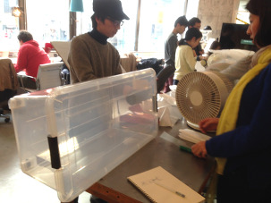

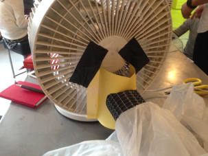

 
We cut out a hole in the plastic container and attached the duct. The plastic was so thick we had to use a drill and saw.

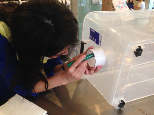

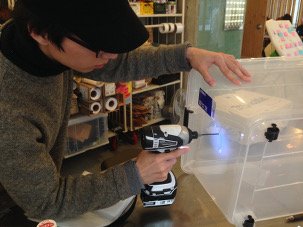

 

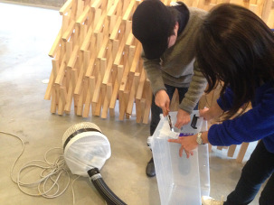

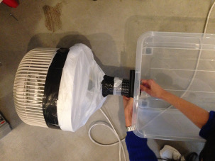

 
We cut out two rectangles from the lid and taped it together to make windows so we can insert our arms.

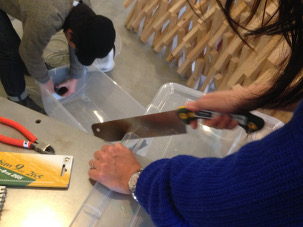

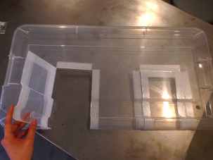

 
We covered the duct with a piece of filter. Since HEPA filters are very expensive we used cheaper filters which are used for air conditioners.

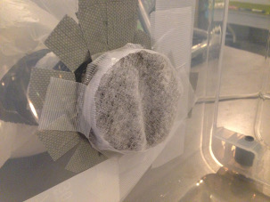

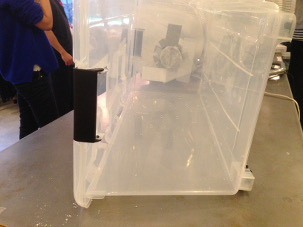

 
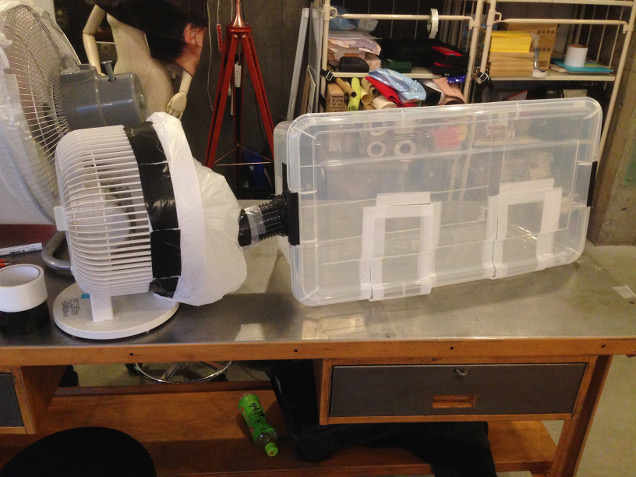

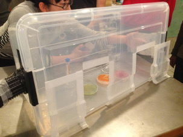

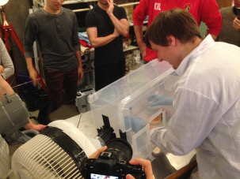

 
Though we used the same materials, each team came up with different designs.

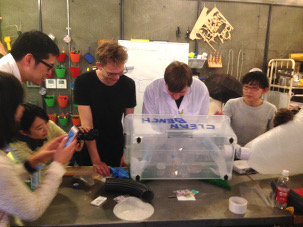

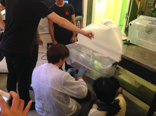

